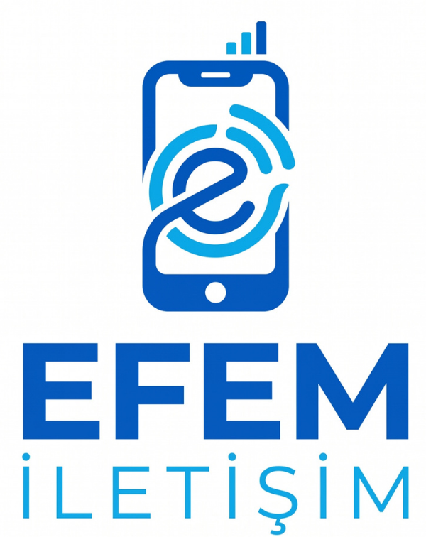
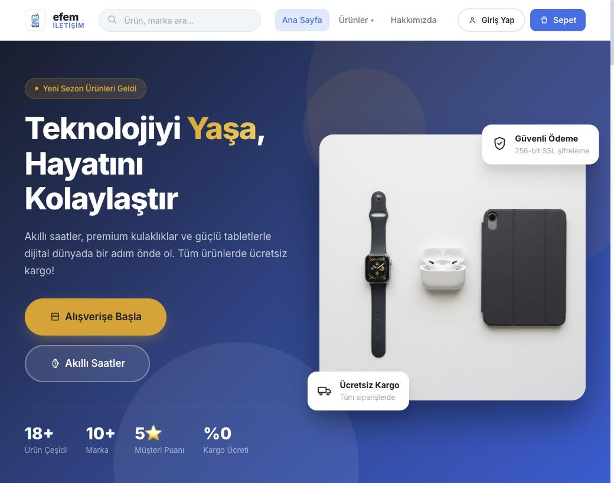
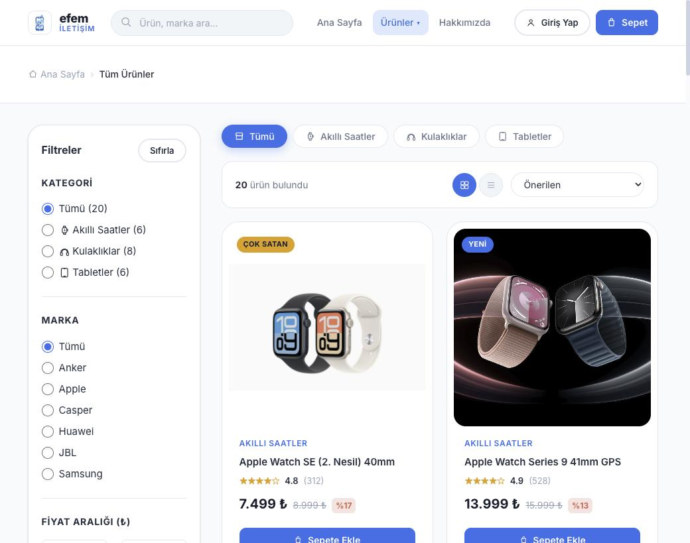
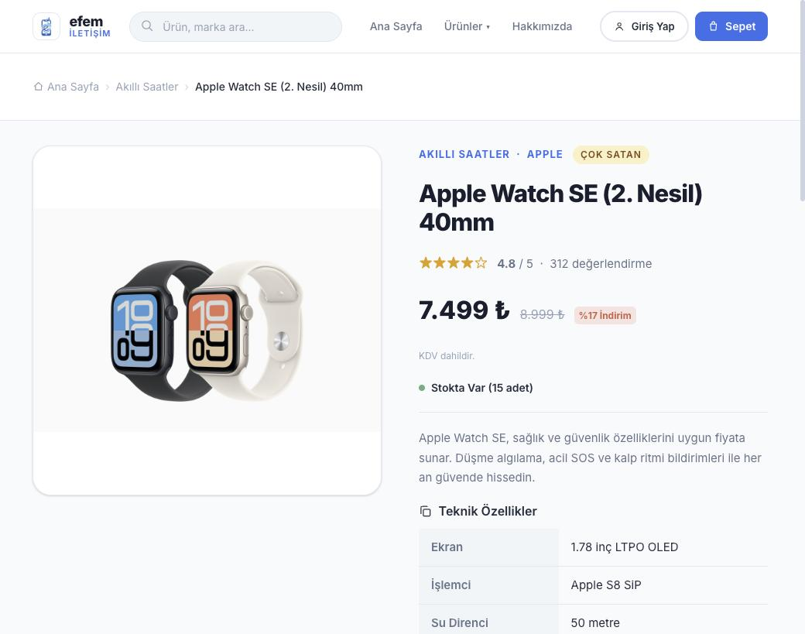
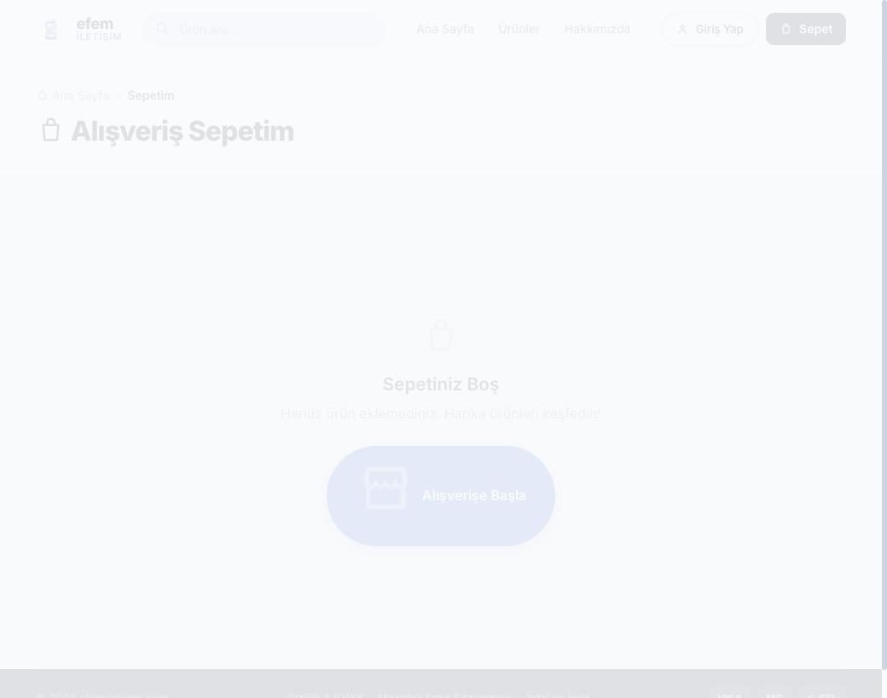

<div align="center">
  

  <h1>efemiletisim.com</h1>
  <p><strong>Akıllı saat, kulaklık ve teknoloji aksesuarları mağazası</strong> — Vanilla JS + Firebase ile inşa edilmiş, statik hosting üzerinde çalışan hızlı bir e-ticaret sitesi.</p>

  <p>
    
    
    
    
    
  </p>
</div>

---

## Ekran Görüntüleri

| Ana Sayfa | Ürün Listeleme |
|---|---|
|  |  |

| Ürün Detay | Sepet |
|---|---|
|  |  |

---

## Özellikler

- **Ürün kataloğu** — kategori (akıllı saat / kulaklık / aksesuar / ses & diğer) ve marka bazlı filtreleme, fiyat aralığı, minimum puan, sıralama (fiyat/puan/yeni/öne çıkan)
- **Canlı arama** — navbar üzerinden anlık ürün/marka arama dropdown'u
- **Ürün detay** — galeri, teknik özellik tablosu, ilgili ürünler, stok durumu
- **Favoriler** — localStorage tabanlı, profil sayfasında listeleniyor
- **Sepet** — miktar güncelleme, kupon kodu desteği (altyapı hazır, kampanya aktif edilmeyi bekliyor)
- **Ödeme akışı** — adres formu + kart formu, iyzico sandbox simülasyonu ile test kartları
- **Üyelik** — Firebase Authentication (e-posta doğrulama dahil), Firestore'da sipariş/favori geçmişi
- **Hesap paneli** — sipariş geçmişi, favoriler, adres ve profil yönetimi
- **Admin paneli** (`admin.html`) — ürün/sipariş yönetimi arayüzü
- **Kurumsal tek-kaynak yapı** — tüm marka/iletişim/yasal bilgiler `js/site-config.js`'ten besleniyor, sayfalarda tekrar yok
- **SEO** — `sitemap.xml`, `robots.txt`, Organization/Product schema.org enjeksiyonu
- **Yasal sayfalar** — KVKK/gizlilik, mesafeli satış sözleşmesi, iptal/iade
- **Güvenlik başlıkları** — CSP, HSTS, X-Frame-Options vb. `vercel.json` üzerinden
- **Mikro etkileşimler** — magnetic hover butonlar, scroll-reveal, sayaç animasyonları

## Teknoloji Yığını

| Katman | Teknoloji |
|---|---|
| Frontend | Vanilla HTML5 / CSS3 / JavaScript (framework yok, build adımı yok) |
| Kimlik doğrulama & veri | Firebase Authentication + Firestore |
| Ödeme | iyzico (şu an **sandbox simülasyonu**, gerçek entegrasyon bekliyor) |
| Hosting | Vercel (`vercel.json`) + Firebase Hosting yapılandırması (`firebase.json`) |
| Diğer | localStorage (sepet/favoriler), schema.org JSON-LD, CSP güvenlik başlıkları |

## Proje Yapısı

```
├─ index.html, urunler.html, urun-detay.html,
│  sepet.html, odeme.html, hesap.html, profil.html,
│  hakkimizda.html, admin.html          → sayfalar (routing nedeniyle kökte)
├─ css/                                  → main / components / pages
├─ js/
│  ├─ site-config.js                     → TEK kaynak: marka, iletişim, yasal künye
│  ├─ data.js                            → ürün kataloğu
│  ├─ products.js                        → filtre, arama, favori, ürün kartı
│  ├─ cart.js                            → sepet, kupon, toplam hesaplama
│  ├─ payment.js                         → ödeme formu + iyzico sandbox simülasyonu
│  ├─ auth.js / firebase-auth.js         → üyelik, Firestore sipariş/favori
│  └─ main.js                            → navbar, toast, animasyonlar, SEO schema
├─ assets/                               → images, icons, logos
├─ docs/                                 → RAPOR.md, ARKADAS-YAPILACAKLAR.md, screenshots
├─ vercel.json / firebase.json           → hosting + güvenlik başlıkları
└─ sitemap.xml / robots.txt
```

## Kurulum

Build adımı yok — statik dosyalar. Yerelde çalıştırmak için herhangi bir statik sunucu yeterli:

```bash
python3 -m http.server 8000
# veya
npx serve .
```

Ardından `http://localhost:8000` adresini açın.

Firebase bağlantısı için `js/firebase-config.js` içindeki proje anahtarlarını kendi Firebase projenizle güncelleyin.

## Durum

Ödeme akışı şu an **iyzico sandbox simülasyonu** ile çalışıyor (gerçek para hareketi yok, test kartlarıyla başarılı/başarısız senaryo üretiliyor). Prod'a çıkmadan önce gerçek iyzico API entegrasyonu ve bir backend/serverless katmanı gerekiyor — detaylar için `docs/RAPOR.md`.

---

<div align="center">
  <sub>© 2026 efemiletisim.com — Efem İletişim Teknoloji San. ve Tic. Ltd. Şti.</sub>
</div>
